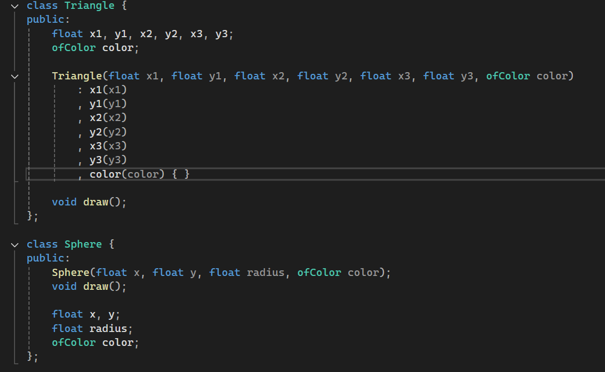
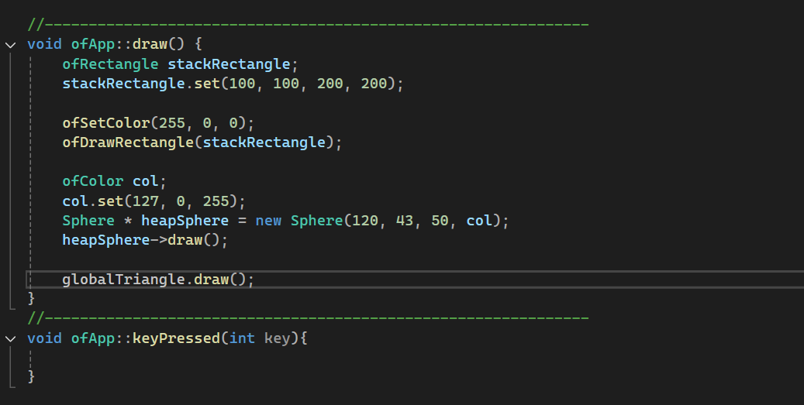

## Actividad 1
Al ejecutar el programa se crea una ventana de fondo negro y se genera un circulo de radio 20 y de color blanco que sigue el mouse.

## Actividad 2
### ¿Qué fue lo que incluimos en el archivo .h?
Definimos la clase ofApp, que hereda de ofBaseApp y que contiene unas funciones publicas (setup(), update(), draw(), mouseMoved(int x, int y) y mousePressed(int x, int y, int button)) y unos atributos privados (vector particles; y ofColor particleColor;).
### ¿Cómo funciona la aplicación?
Genera un fondo negro y pinta varios circulos que siguen el mouse de color blanco, pero si se da click los circulos cambiaran de color y ademas los que queden atras se borraran.
### ¿Qué hace la función mouseMoved?
Elimina los circulos que quedan atras si se excede el tamaño del vector.
### ¿Qué hace la función mousePressed?
Cambia el color asignando un valor aleatorio de RGB.
### ¿Qué hace la función setup?
Fija el fondo negro e inicializa con las "particulas" de color blanco.
### ¿Qué hace la función update?
No logro ver si realiza alguna accion.
### ¿Qué hace la función draw?
Establece el color actual y dibuja el circulo.

## Actividad 3
Agregue dos lines de codigo, una en draw() para que se dibujara un triangulo, para esto le puse una coordenada a cada uno de los vertices e hice que los mismos actualizaran su posicion segun el movimiento del mouse:
```
ofDrawTriangle(pos.x -250, pos.y +50, pos.x +50, pos.y -200, pos.x +450, pos.y +200);
 ```
 
Y otra en mouseMoved() para que cambie de color siempre que se mueva el mouse:
```
particleColor = ofColor(ofRandom(255), ofRandom(255), ofRandom(255));
 ```

## Actividad 5
¿Cuál es la definición de un puntero?
Se puede definir a un puntero como aquella variable que puede almacenar la direccion de memoria de otra variable.
¿Dónde está el puntero?
En ofApp.h
¿Cómo se inicializa el puntero?
Con las lineas de codigo:
```
  vector<Sphere> spheres;
        Sphere selectedSphere;
 ```
 
¿Para qué se está usando el puntero?
Guarda la direccion de memoria de la esfera lo cual sirve para interactuar con la misma.
¿Qué es exactamente lo que está almacenado en el puntero?
La direccion de memoria de la esfera seleccionada.

## Actividad 6
El problema es que al tomar un circulo ya no lo puedes volver a soltar.
```
void mouseReleased(int x, int y, int button);
 ```

```
void ofApp::mouseReleased(int x, int y, int button){
    if(button == OF_MOUSE_BUTTON_LEFT){
        selectedSphere = nullptr;
    }
}
```
 
## Actividad 7
¿Qué sucede cuando presionas la tecla “c”? (1)
Cuando se presiona la tecla “c”, el programa crea una esfera que se borra al terminar la función luego el vector guarda su dirección, pero como esa memoria ya no existe, el puntero queda malo y el programa puede mostrar distintos errores, sean fallos o mostrando cosas erroneas.
¿Qué sucede cuando presionas la tecla “c”? (2)
Se crea una esfera en el heap y su puntero se guarda en el vector.
¿Por qué ocurre esto?
Debido a que el heap no elimina la esfera al terminar su funcion cosa que resuelve el problema del puntero y lo hace valido.

## Actividad 8
ofApp.h:

Definición de la clase triángulo y esfera:


Métodos predeterminados:


ofApp.cpp:

Métodos y constructores de triánulo y esfera:


Función dibujar esfera, triángulo y rectángulo:


### Prueba de funcionamiento: 


## Actividad 9
¿Qué sucede cuando presionas la tecla “f”?

Se eliminan los circulos creados al dar click.S