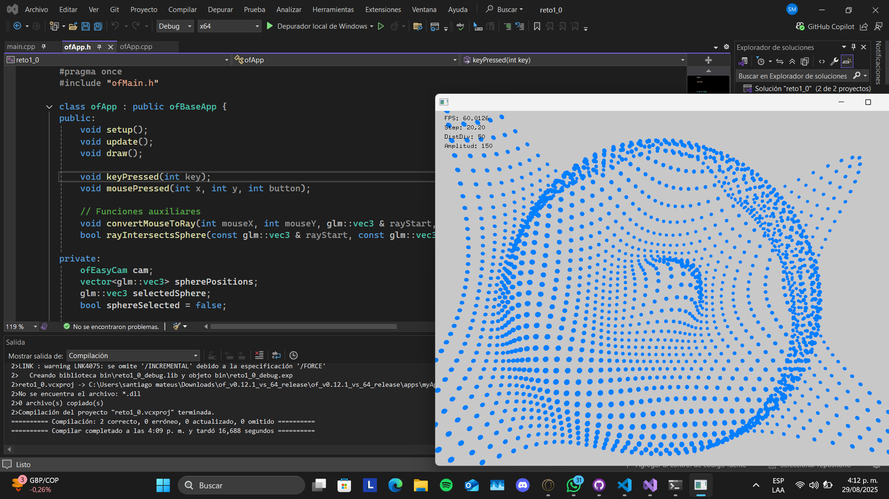

## Reto 1:

### código .cpp
```
#include "ofApp.h"

//--------------------------------------------------------------
void ofApp::setup() {
	ofSetFrameRate(60);
	ofBackground(200);

	
	for (int x = -ofGetWidth() / 2; x < ofGetWidth() / 2; x += xStep) {
		for (int y = -ofGetHeight() / 2; y < ofGetHeight() / 2; y += yStep) {
			float z = cos(ofDist(x, y, 0, 0) / distDiv) * amplitude;
			spherePositions.push_back(glm::vec3(x, y, z));
		}
	}
}

//--------------------------------------------------------------
void ofApp::update() {
	
}

//--------------------------------------------------------------
void ofApp::draw() {
	cam.begin();

	ofSetColor(0, 127, 255);
	for (auto & pos : spherePositions) {
		if (sphereSelected && pos == selectedSphere) {
			ofSetColor(0, 255, 0); // Verde si está seleccionada
			ofDrawSphere(pos, 8);
			ofSetColor(255, 200, 0);
		} else {
			ofDrawSphere(pos, 5);
		}
	}

	cam.end();

	// Info en pantalla
	ofSetColor(0);
	ofDrawBitmapString("FPS: " + ofToString(ofGetFrameRate()), 20, 20);
	ofDrawBitmapString("Step: " + ofToString(xStep) + "," + ofToString(yStep), 20, 40);
	ofDrawBitmapString("DistDiv: " + ofToString(distDiv), 20, 60);
	ofDrawBitmapString("Amplitud: " + ofToString(amplitude), 20, 80);

	if (sphereSelected) {
		ofDrawBitmapString("Esfera seleccionada: " + ofToString(selectedSphere), 20, 100);
	}
}

//--------------------------------------------------------------
void ofApp::keyPressed(int key) {
	if (key == OF_KEY_UP) amplitude += 10;
	if (key == OF_KEY_DOWN) amplitude -= 10;
	if (key == OF_KEY_RIGHT) distDiv += 5;
	if (key == OF_KEY_LEFT) distDiv -= 5;

	if (key == '+') {
		xStep += 2;
		yStep += 2;
	}
	if (key == '-') {
		xStep -= 2;
		yStep -= 2;
	}

	// Regenerar posiciones
	spherePositions.clear();
	for (int x = -ofGetWidth() / 2; x < ofGetWidth() / 2; x += xStep) {
		for (int y = -ofGetHeight() / 2; y < ofGetHeight() / 2; y += yStep) {
			float z = cos(ofDist(x, y, 0, 0) / distDiv) * amplitude;
			spherePositions.push_back(glm::vec3(x, y, z));
		}
	}
}

//--------------------------------------------------------------
void ofApp::mousePressed(int x, int y, int button) {
	glm::vec3 rayStart, rayEnd;
	convertMouseToRay(x, y, rayStart, rayEnd);

	sphereSelected = false;
	for (auto & pos : spherePositions) {
		glm::vec3 intersectionPoint;
		if (rayIntersectsSphere(rayStart, rayEnd - rayStart, pos, 6.0, intersectionPoint)) {
			selectedSphere = pos;
			sphereSelected = true;
			break;
		}
	}
}

//--------------------------------------------------------------
void ofApp::convertMouseToRay(int mouseX, int mouseY, glm::vec3 & rayStart, glm::vec3 & rayEnd) {
	glm::mat4 modelview = cam.getModelViewMatrix();
	glm::mat4 projection = cam.getProjectionMatrix();
	ofRectangle viewport = ofGetCurrentViewport();

	float x = 2.0f * (mouseX - viewport.x) / viewport.width - 1.0f;
	float y = 1.0f - 2.0f * (mouseY - viewport.y) / viewport.height;

	glm::vec4 rayStartNDC(x, y, -1.0f, 1.0f);
	glm::vec4 rayEndNDC(x, y, 1.0f, 1.0f);

	glm::vec4 rayStartWorld = glm::inverse(projection * modelview) * rayStartNDC;
	glm::vec4 rayEndWorld = glm::inverse(projection * modelview) * rayEndNDC;

	rayStartWorld /= rayStartWorld.w;
	rayEndWorld /= rayEndWorld.w;

	rayStart = glm::vec3(rayStartWorld);
	rayEnd = glm::vec3(rayEndWorld);
}

//--------------------------------------------------------------
bool ofApp::rayIntersectsSphere(const glm::vec3 & rayStart, const glm::vec3 & rayDir,
	const glm::vec3 & sphereCenter, float sphereRadius,
	glm::vec3 & intersectionPoint) {
	glm::vec3 oc = rayStart - sphereCenter;

	float a = glm::dot(rayDir, rayDir);
	float b = 2.0f * glm::dot(oc, rayDir);
	float c = glm::dot(oc, oc) - sphereRadius * sphereRadius;

	float discriminant = b * b - 4 * a * c;

	if (discriminant < 0) {
		return false;
	} else {
		float t = (-b - sqrt(discriminant)) / (2.0f * a);
		intersectionPoint = rayStart + t * rayDir;
		return true;
	}
}
```
### Código .h
```
#pragma once
#include "ofMain.h"

class ofApp : public ofBaseApp {
public:
	void setup();
	void update();
	void draw();

	void keyPressed(int key);
	void mousePressed(int x, int y, int button);

	// Funciones auxiliares
	void convertMouseToRay(int mouseX, int mouseY, glm::vec3 & rayStart, glm::vec3 & rayEnd);
	bool rayIntersectsSphere(const glm::vec3 & rayStart, const glm::vec3 & rayDir, const glm::vec3 & sphereCenter, float sphereRadius, glm::vec3 & intersectionPoint);

private:
	ofEasyCam cam; 
	vector<glm::vec3> spherePositions; 
	glm::vec3 selectedSphere; 
	bool sphereSelected = false;

	int xStep = 20;
	int yStep = 20;
	float distDiv = 50.0f;
	float amplitude = 150.0f;
};
```

#### Foto prueba:
