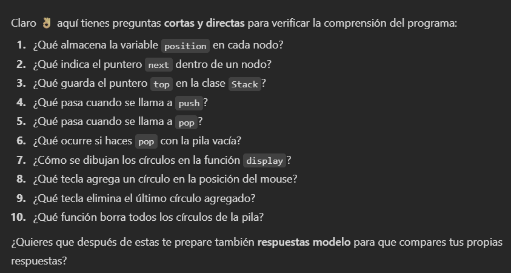

## Actividad 1
### 1:
Información proporcionada por ChatGPT para el entendimiento del código. Se realizó con fines de seguir el proceso formativo, pues los temas y el código en sí fueron entendidos en clase sin ningún inconveniente.

Ejecución realizada con el depurador:

### 2:
Preguntas realizadas por chat para reforzar los conceptos: 

### 3: 
Una lista enlazada es una estructura donde cada elemento guarda sus datos y un puntero al siguiente, de modo que los nodos pueden estar dispersos en la memoria. En cambio, un arreglo guarda todos sus elementos en posiciones contiguas, lo que da mejor rendimiento en acceso, pero tamaño fijo, mientras que la lista es más flexible para crecer o reducirse.

### 4: 
Los nodos se vinculan entre sí usando un puntero dentro de cada nodo (next), que guarda la dirección del siguiente nodo en la lista.

### 5:
La memoria en una lista enlazada se gestiona creando cada nodo con new, que lo guarda en el heap, y liberándolo con delete cuando ya no se usa. Así, cada vez que agregas un nodo haces new, y al borrar o limpiar la lista debes recorrerla y hacer delete en cada nodo para evitar fugas.

### 6:
La lista enlazada permite insertar o eliminar en medio de forma rápida porque solo cambias punteros, sin mover todos los elementos como en un arreglo.

### 7:
Se evita la fuga de memoria con el destructor de LinkedList, que recorre la lista y libera cada nodo con delete. Así se asegura que, al destruir la lista, todos los nodos también se eliminen.

### 8:
1. current = head (empieza en el primer nodo).
2. Mientras current no sea nullptr: guarda next = current->next.
3. delete current — esto llama al destructor del Node y devuelve su memoria al heap.
4. current = next (avanza al siguiente nodo) y repite.
5. Al terminar, head = tail = nullptr y size = 0.
6. Nota: después de delete cualquier puntero al nodo es dangling (no usarlo). Si el Node tiene objetos, sus destructores se ejecutan al delete.

### 9:
Al agregar un nodo al final, se crea con new, se enlaza el puntero next del nodo que era tail hacia el nuevo, y luego tail pasa a apuntar a ese nuevo nodo. En memoria, solo se reserva espacio para ese nodo, no se mueven los demás. Esto hace que insertar al final sea muy rápido (O(1)) si tienes tail, a diferencia de un arreglo que podría requerir mover o copiar elementos.

### 10:
Una lista enlazada es mejor cuando necesitas insertar o eliminar muchos elementos en medio de la colección, porque solo cambias punteros y no mueves todo. Además, la memoria se pide poco a poco con new, sin necesidad de reservar un bloque grande como en un arreglo, lo que la hace más flexible si no sabes cuántos datos tendrás.

### 11:
Podría aplicar este conocimiento creando una estructura que guarde, por ejemplo, el historial de movimientos en un juego o pasos de una animación. Para hacerlo eficiente tendría en cuenta: usar punteros bien gestionados (o smart pointers para automatizar delete), asegurar que los destructores liberen toda la memoria, y elegir la estructura según la necesidad (lista si voy a insertar mucho, arreglo si accedo mucho). Así evito fugas y mantengo un buen rendimiento.

### 12:
En C++ tú controlas la memoria con new y delete, lo que da más eficiencia y control (puedes optimizar al detalle), pero también más riesgo de fugas o errores si olvidas liberar. En C# la basura se recoge sola, lo que simplifica el trabajo y evita fugas, aunque a veces con pausas y menos control. La ventaja de C++ es el rendimiento y precisión; el desafío es la responsabilidad extra de manejar bien la memoria.

### 13:
Tendría en cuenta usar destructores claros que borren todos los nodos, evitar crear nodos innecesarios, y reutilizar objetos cuando se pueda. También consideraría smart pointers para automatizar la liberación y revisar que cada new tenga su delete. Así la memoria se mantiene limpia y la pieza corre fluida sin fugas.

### 14: 
Para probar inicialmente el código parte por parte podemos probar con la creación de un nodo y ver si sus componentes son exactas a las estipuladas por el constructor. O realizar el código de LinkedList para ver si con una lista vacía tenemos "head == nullptr, tail == nullptr y size == 0". 

## Actividad 2:

### Reporte en bitácora:

#### 1:(Realizado con el código de la PILA)
En palabras de ChatGPT: "Este programa en openFrameworks implementa una pila (stack) sencilla usando una lista enlazada propia (Node + Stack). Cada nodo contiene una posición 2D (ofVec2f). Cuando presionas la tecla 'a' apila (push) un nuevo círculo en la posición actual del ratón; cuando presionas 'd' desapila (pop) el último círculo. En draw() se recorren los nodos y se dibujan círculos con ofDrawCircle." 

Además, ChatGPT me dio una serie de conceptos clave para entender mejor el código: 
1. #pragma once

Evita inclusiones múltiples del mismo header. Es equivalente a un include-guard.

2. class Node

ofVec2f position; — contiene las coordenadas x,y del nodo.

Node* next; — puntero al siguiente nodo en la lista (lista enlazada simple).

Constructor Node(float x, float y) inicializa la posición y pone next = nullptr.

Nota: cada Node se creará con new, por lo que vive en el heap hasta que se deleteea.

3. class Stack

Node* top; — puntero al tope de la pila (el elemento más reciente). Si top == nullptr, la pila está vacía.

Stack() inicializa top = nullptr.

~Stack() llama a clear() para liberar memoria al destruir la pila (RAII manual).

push(float x, float y):

Crea newNode = new Node(x, y).

newNode->next = top; enlaza la nueva cabeza con la anterior.

top = newNode; actualiza la cabeza (LIFO).

Complejidad: O(1).

pop():

Si top != nullptr, guarda temp = top, mueve top = top->next, y delete temp.

Evita delete cuando la pila está vacía.

Complejidad: O(1).

clear():

Llama repetidamente a pop() hasta vaciar la pila.

display():

Recorre desde top hasta nullptr, y para cada nodo dibuja un círculo: ofDrawCircle(current->position.x, current->position.y, 20);

Complejidad: O(n) donde n = número de nodos.

3. class ofApp : public ofBaseApp

Stack circleStack; — instancia de la pila como miembro.

setup() — se ejecuta al iniciar la app; aquí se pone el fondo gris con ofSetBackgroundColor(220).

update() — vacío (se puede usar para lógica por frame).

draw() — dibuja la pila llamando circleStack.display();

keyPressed(int key) — gestiona teclado:

'a' → push con la posición actual del ratón (ofGetMouseX(), ofGetMouseY()).

'd' → pop.

openFrameworks llama automáticamente a setup(), luego en ciclo update()+draw() ~60 FPS (u otra tasa), y responde a eventos como keyPressed."

4. EL CÓDIGO FUNCIONA POR MEDIO DEL DEPURADOR DE WINDOWS. 

#### 2 (Con el código 1):

preguntas desarrolladas por chat: 

Respuestas:

1. La variable position guarda las coordenadas (x, y) donde se dibuja el círculo.
2. El puntero next indica cuál es el siguiente nodo en la pila.
3. El puntero top guarda la dirección del nodo que está en la cima de la pila.
4. Cuando llamo a push, se crea un nuevo nodo con la posición del mouse y se coloca en el tope de la pila.
5. Cuando llamo a pop, se elimina el nodo que está en el tope y se actualiza el puntero top al siguiente.
6. Si hago pop con la pila vacía no pasa nada porque solo se efectúa pop si la lista no es nula. 
7. En display, se recorre la lista desde top hasta el final y se dibuja un círculo en la posición de cada nodo.
8. Con la tecla 'a' agrego un círculo en la posición actual del mouse.
9. Con la tecla 'd' elimino el último círculo agregado (el que está en la cima).
10. La función clear borra todos los círculos de la pila.

#### PRUEBA DE FUNCIONAMIENTO POR PARTES
Profe no sabría como desarrollar una prueba por partes, según lo que dice ChatGPT, es como hacer una versión simple y no extendida de algunas funciones básicas pero ya depuré y probé el programa hasta ciertos puntos y también de forma completa, en ambos casos se desarrolla correctamente sin ningún tipo de problema o de error. 

### Preguntas de reflexión para el Stack:

#### 1 Gestión de memoria en un stack manual

Se utiliza new para reservar memoria de cada nodo y delete para liberarla. Esto da control, pero aumenta el riesgo de fugas y errores como punteros colgantes o doble liberación.

#### 1 Importancia de liberar memoria al desapilar

Si no se libera, se producen fugas de memoria que, en aplicaciones de larga ejecución, acumulan consumo innecesario y pueden causar fallos o lentitud.

#### 3 Diferencias entre std::stack y stack manual

std::stack abstrae la gestión de memoria y simplifica la implementación, reduciendo errores. El stack manual da mayor control sobre recursos, pero requiere gestionar memoria de forma segura.

#### 4 Influencia de la estructura en acceso y eliminación

El stack sigue la regla LIFO (último en entrar, primero en salir), lo que lo hace eficiente para tareas como deshacer operaciones, backtracking o manejar llamadas anidadas.

#### 5 Almacenar datos más complejos

Puede modificarse el nodo para contener objetos con múltiples atributos. Para evitar problemas, deben aplicarse técnicas seguras de gestión de memoria (Rule of Three/Five) o usarse smart pointers o contenedores STL.

### Preguntas de reflexión para la Queue:

#### 1 Manejo de memoria en una queue manual

Cada elemento se almacena en un nodo dinámico. En enqueue se reserva memoria con new y en dequeue se libera con delete. La eficiencia depende de un manejo seguro de punteros, evitando fugas o accesos inválidos.

#### 2 Desafíos frente a un stack

La queue requiere controlar dos punteros: front y rear. Si no se actualizan correctamente al encolar o desencolar, pueden perderse nodos o producir accesos inválidos, aumentando la complejidad frente al stack.

#### 3 Influencia de la estructura FIFO

La naturaleza FIFO asegura que el primer elemento en entrar es el primero en salir, lo que es esencial en sistemas de colas, procesamiento de tareas en orden o gestión de recursos compartidos.

#### 4 Ventajas de una queue circular

Una queue circular reutiliza el espacio de nodos liberados, evitando desperdicio de memoria que ocurre en una queue lineal. Para implementarla, se actualizan front y rear con aritmética modular.

#### 5 Problemas por mala gestión de punteros

Errores como perder la referencia a nodos, crear ciclos o acceder a memoria liberada surgen si front y rear no se manejan bien. Se evitan con actualizaciones cuidadosas, comprobaciones de vaciado y control de límites.
