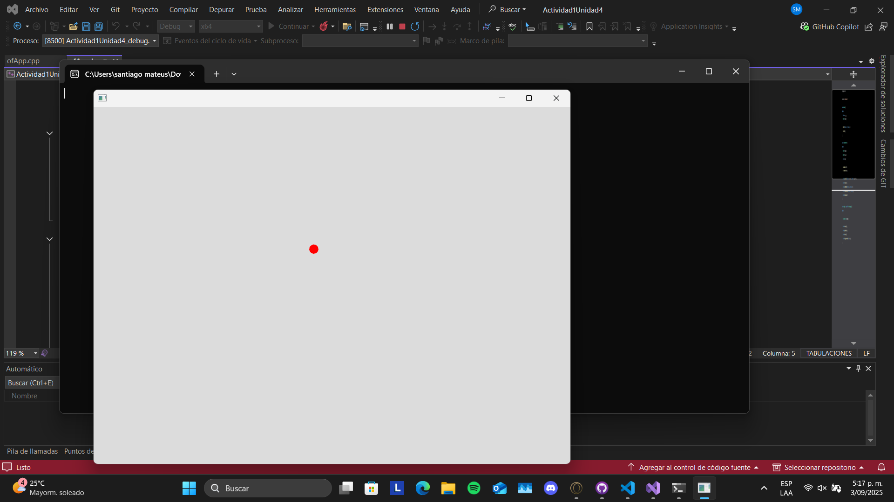

## Actividad 1
### 1:
Información proporcionada por ChatGPT para el entendimiento del código. Se realizó con fines de seguir el proceso formativo, pues los temas y el código en sí fueron entendidos en clase sin ningún inconveniente.

Ejecución realizada con el depurador:

### 2:
Preguntas realizadas por chat para reforzar los conceptos: 

### 3: 
Una lista enlazada es una estructura donde cada elemento guarda sus datos y un puntero al siguiente, de modo que los nodos pueden estar dispersos en la memoria. En cambio, un arreglo guarda todos sus elementos en posiciones contiguas, lo que da mejor rendimiento en acceso, pero tamaño fijo, mientras que la lista es más flexible para crecer o reducirse.

### 4: 
Los nodos se vinculan entre sí usando un puntero dentro de cada nodo (next), que guarda la dirección del siguiente nodo en la lista.

### 5:
La memoria en una lista enlazada se gestiona creando cada nodo con new, que lo guarda en el heap, y liberándolo con delete cuando ya no se usa. Así, cada vez que agregas un nodo haces new, y al borrar o limpiar la lista debes recorrerla y hacer delete en cada nodo para evitar fugas.

### 6:
La lista enlazada permite insertar o eliminar en medio de forma rápida porque solo cambias punteros, sin mover todos los elementos como en un arreglo.

### 7:
Se evita la fuga de memoria con el destructor de LinkedList, que recorre la lista y libera cada nodo con delete. Así se asegura que, al destruir la lista, todos los nodos también se eliminen.

### 8:
1. current = head (empieza en el primer nodo).
2. Mientras current no sea nullptr: guarda next = current->next.
3. delete current — esto llama al destructor del Node y devuelve su memoria al heap.
4. current = next (avanza al siguiente nodo) y repite.
5. Al terminar, head = tail = nullptr y size = 0.
6. Nota: después de delete cualquier puntero al nodo es dangling (no usarlo). Si el Node tiene objetos, sus destructores se ejecutan al delete.

### 9:
Al agregar un nodo al final, se crea con new, se enlaza el puntero next del nodo que era tail hacia el nuevo, y luego tail pasa a apuntar a ese nuevo nodo. En memoria, solo se reserva espacio para ese nodo, no se mueven los demás. Esto hace que insertar al final sea muy rápido (O(1)) si tienes tail, a diferencia de un arreglo que podría requerir mover o copiar elementos.

### 10:
Una lista enlazada es mejor cuando necesitas insertar o eliminar muchos elementos en medio de la colección, porque solo cambias punteros y no mueves todo. Además, la memoria se pide poco a poco con new, sin necesidad de reservar un bloque grande como en un arreglo, lo que la hace más flexible si no sabes cuántos datos tendrás.

### 11:
Podría aplicar este conocimiento creando una estructura que guarde, por ejemplo, el historial de movimientos en un juego o pasos de una animación. Para hacerlo eficiente tendría en cuenta: usar punteros bien gestionados (o smart pointers para automatizar delete), asegurar que los destructores liberen toda la memoria, y elegir la estructura según la necesidad (lista si voy a insertar mucho, arreglo si accedo mucho). Así evito fugas y mantengo un buen rendimiento.

### 12:
En C++ tú controlas la memoria con new y delete, lo que da más eficiencia y control (puedes optimizar al detalle), pero también más riesgo de fugas o errores si olvidas liberar. En C# la basura se recoge sola, lo que simplifica el trabajo y evita fugas, aunque a veces con pausas y menos control. La ventaja de C++ es el rendimiento y precisión; el desafío es la responsabilidad extra de manejar bien la memoria.

### 13:
Tendría en cuenta usar destructores claros que borren todos los nodos, evitar crear nodos innecesarios, y reutilizar objetos cuando se pueda. También consideraría smart pointers para automatizar la liberación y revisar que cada new tenga su delete. Así la memoria se mantiene limpia y la pieza corre fluida sin fugas.

### 14: 
Para probar inicialmente el código parte por parte podemos probar con la creación de un nodo y ver si sus componentes son exactas a las estipuladas por el constructor. O realizar el código de LinkedList para ver si con una lista vacía tenemos "head == nullptr, tail == nullptr y size == 0". 

