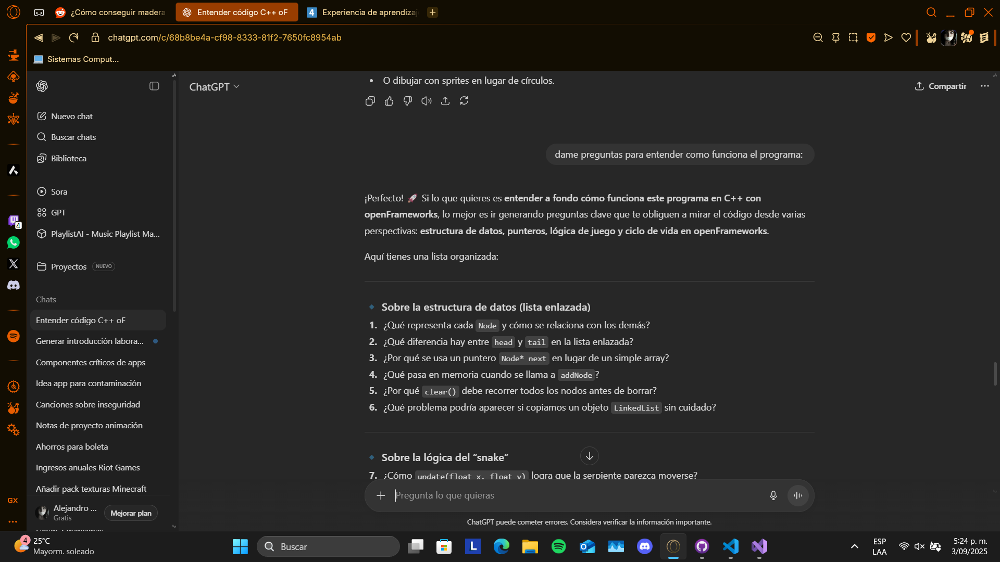

## Actividad 1
### 1:
Información proporcionada por ChatGPT para el entendimiento del código. Se realizó con fines de seguir el proceso formativo, pues los temas y el código en sí fueron entendidos en clase sin ningún inconveniente.

Ejecución realizada con el depurador:

### 2:
Preguntas realizadas por chat para reforzar los conceptos: 

### 3: 
