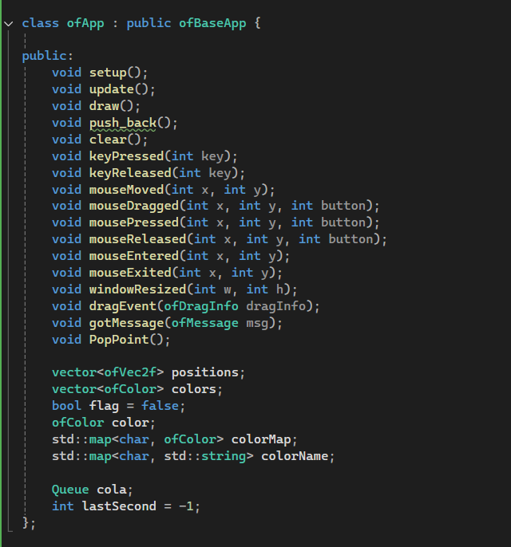

## Reto Completo:

### Archivo completo ".h": 

```
#pragma once

#include "ofMain.h"

class Node {
public:
	int value;
	Node * next;

	Node(int v) {
		value = v;
		next = nullptr;
	}
};

class Queue {
public:
	Node * front;
	Node * rear;

	Queue() {
		front = rear = nullptr;
	}

	~Queue() {
		clear();
	}

	void enqueue(int v) {
		Node * nuevo = new Node(v);
		if (rear == nullptr) {
			front = rear = nuevo;
		} else {
			rear->next = nuevo;
			rear = nuevo;
		}
	}

	void clear() {
		while (front != nullptr) {
			Node * temp = front;
			front = front->next;
			delete temp;
		}
		rear = nullptr;
	}

	int backValue() {
		if (rear != nullptr) return rear->value;
		return 0;
	}
};

class ofApp : public ofBaseApp {

public:
	void setup();
	void update();
	void draw();
	void push_back();
	void clear();
	void keyPressed(int key);
	void keyReleased(int key);
	void mouseMoved(int x, int y);
	void mouseDragged(int x, int y, int button);
	void mousePressed(int x, int y, int button);
	void mouseReleased(int x, int y, int button);
	void mouseEntered(int x, int y);
	void mouseExited(int x, int y);
	void windowResized(int w, int h);
	void dragEvent(ofDragInfo dragInfo);
	void gotMessage(ofMessage msg);
	void PopPoint();

	vector<ofVec2f> positions;
	vector<ofColor> colors;
	bool flag = false;
	ofColor color;
	std::map<char, ofColor> colorMap;
	std::map<char, std::string> colorName;

	Queue cola;
	int lastSecond = -1;
};

```
### Archivo completo ".cpp":

```
#include "ofApp.h"

//--------------------------------------------------------------
void ofApp::setup(){
	//Background
	ofSetBackgroundColor(224, 224, 224);
	color = ofColor::black;

	colorMap['q'] = ofColor(245, 39, 39); //Rojo
	colorName['q'] = "Rojo";
	colorMap['w'] = ofColor(77, 54, 54); //Marron
	colorName['w'] = "Marron";
	colorMap['e'] = ofColor(84, 198, 232); //Celeste
	colorName['e'] = "Celeste";
	colorMap['r'] = ofColor(163, 113, 113); //Rosa oscuro (arrugas y demás)
	colorName['r'] = "Rosa oscuro para arrugas y otros";
	colorMap['t'] = ofColor(0); //Negro again
	colorName['t'] = "Negro otra vez";
}

//--------------------------------------------------------------
void ofApp::update(){
	int currentSecond = (int)ofGetElapsedTimef();

	if (currentSecond != lastSecond) {
		cola.enqueue(currentSecond);
		lastSecond = currentSecond;
	}
}
//--------------------------------------------------------------
void ofApp::PopPoint() {
	if (!positions.empty() && !colors.empty()) {
		positions.pop_back();
		colors.pop_back();
	}
}

//--------------------------------------------------------------
void ofApp::draw(){
	//Cara
	ofSetColor(255, 220, 180);
	ofDrawCircle(ofGetWidth() / 2, ofGetHeight() / 2, 200);

	for (size_t i = 0; i < positions.size(); i++) {
		ofSetColor(colors[i]);
		ofDrawCircle(positions[i].x, positions[i].y, 5);
	}

	int y = 20;
	for (auto const & [key, col] : colorMap) {
		string KeyStr(1, key);
		string info = "Tecla: " + KeyStr + "-> Color: " + colorName[key];
		ofSetColor(0);
		ofDrawBitmapString(info, 20, y);
		y += 20;
	}

	string message = "Dibuja una carita, lo que tu quieras :D ";
	ofSetColor(0);
	ofDrawBitmapString(message, 600, 20);

	string message2 = "Designed por Santiago Mateus";
	ofSetColor(0);
	ofDrawBitmapString(message2, 600, 640);

	ofSetColor(0);
	ofDrawBitmapString("Segundos transcurridos:", 20, ofGetHeight() - 40);
	ofDrawBitmapString(ofToString(cola.backValue()), 20, ofGetHeight() - 20);
}

//--------------------------------------------------------------
void ofApp::clear() {

	positions.clear();
	colors.clear();
}

//--------------------------------------------------------------
void ofApp::keyPressed(int key){
	if (colorMap.find(key) != colorMap.end()) {
		color = colorMap[key];
	}
	if (key == 'c') {
		PopPoint();
	}

	if (key == 'd') {
		clear();
	}
}

//--------------------------------------------------------------
void ofApp::keyReleased(int key){

}

//--------------------------------------------------------------
void ofApp::mouseMoved(int x, int y ){

}

//--------------------------------------------------------------
void ofApp::mouseDragged(int x, int y, int button){
	if (flag) {
		positions.push_back(ofVec2f(ofGetMouseX(), ofGetMouseY()));
		colors.push_back(color);
	}
}

//--------------------------------------------------------------
void ofApp::mousePressed(int x, int y, int button){
	flag = true;
}

//--------------------------------------------------------------
void ofApp::mouseReleased(int x, int y, int button){
	flag = false;
}

//--------------------------------------------------------------
void ofApp::mouseEntered(int x, int y){

}

//--------------------------------------------------------------
void ofApp::mouseExited(int x, int y){

}

//--------------------------------------------------------------
void ofApp::windowResized(int w, int h){

}

//--------------------------------------------------------------
void ofApp::gotMessage(ofMessage msg){

}

//--------------------------------------------------------------
void ofApp::dragEvent(ofDragInfo dragInfo){ 

}

```

### Imagen de prueba: 


### Análisis completo: 

#### 1. ¿Qué efecto visual quería crear?
El efecto visual de mi programa es un sistema de dibujo interactivo simple. Permite al usuario "pintar" en la pantalla arrastrando el mouse, dejando un rastro de pequeños círculos que cambian de color al presionar diferentes teclas. La intención es que el usuario pueda crear una "carita" u otro dibujo, con la capacidad de cambiar de color.

#### 2. ¿Cómo me ayudaron las estructuras de datos a lograr esto? 
Las estructuras de datos son esenciales para lograr este efecto de dibujo. A continuación, se explica cómo cada una de ellas contribuye al resultado final:

1. std::vector (Vectores)
Función: Los vectores positions y colors son las estructuras de datos principales para almacenar y gestionar los datos del dibujo.

Uso en el programa: con POSITIONS se guarda la ubicación (x,y) de cada círculo. Cuando el usuario arrastra el mouse, se añade una nueva posición al vector. Y con COLORS se almacena el color de cada círculo, correspondiente a su posición.
Los usé porque permiten añadir elementos de forma dinámica a medida que el usuario dibuja. La naturaleza secuencial de los vectores facilita dibujar cada círculo en el orden en que fue creado, simplemente recorriéndolos con un bucle for. Las funciones como .push_back() para añadir elementos y .pop_back() para borrarlos son perfectas para las acciones de dibujo y borrado.

2. std::map (Mapa)
Función: Un mapa asocia una clave con un valor, lo que lo hace ideal para crear diccionarios o tablas de búsqueda.

Uso en el programa: Los mapas colorMap y colorName asocian la tecla (char) que el usuario presiona con un color (ofColor) o un nombre (std::string), respectivamente. Fácil para el entendimiento de la dinámica.

3. Queue (Cola)
Función: Una cola es una estructura de datos que sigue el principio FIFO (First-In, First-Out), es decir, el primer elemento que entra es el primero en salir.

Uso en el programa: La cola cola se usa para almacenar los segundos transcurridos desde que se inició el programa. Cada segundo se agrega un nuevo valor a la cola. Aunque en mi código solo uso el último valor (backValue()) para mostrar el tiempo transcurrido.

#### 3. ¿Cómo gestioné la memoria del programa?
Primero, debía considerar cómo crear las variables, en qué tipo de memoria crearlas y después entender como eliminarlas periódicamente o apenas se cerrara el programa para que no existieran fugas una vez ya se hubiera completado el proceso. 

1. La Cola y el Manejo de Nodos
La parte más importante de la gestión de la memoria está en mi clase Queue. Para cada nuevo nodo que creo con new, soy consciente de que debo liberarlo manualmente. Para ello, implementé un destructor (~Queue()) que llama a un método clear().

delete temp;: Esta línea es crucial. Dentro del bucle while en clear(), recorro cada nodo de la cola y uso delete para liberar la memoria del montón (heap) que había solicitado. Esto garantiza que no se acumule memoria basura. Es mi responsabilidad como desarrollador devolver esa memoria al sistema, y mi código lo hace de manera efectiva.

```

~Queue() {
    clear();
}

void clear() {
    while (front != nullptr) {
        Node * temp = front;
        front = front->next;
        delete temp;
    }
    rear = nullptr;
}
```

2. Variables de la Clase ofApp
El resto de las variables que usé, como los vectores positions y colors, y los mapas colorMap y colorName, son variables miembro de la clase ofApp. Esto significa que su memoria no necesita ser liberada manualmente.

Gestión Automática: El sistema operativo se encarga de liberar la memoria de estas variables automáticamente cuando el programa finaliza y el objeto ofApp es destruido. Por ejemplo, los vectores std::vector en C++ tienen su propia gestión de memoria interna; cuando añado elementos con push_back(), ellos se encargan de la asignación de memoria. Al terminar el programa, toda esa memoria es liberada sin que yo tenga que hacer nada más.

#### 4. Interacción con el Usuario
Para lograr que la interacción del usuario influya en múltiples estructuras de datos de forma simultánea y crear un efecto visual dinámico y coherente, diseñé diseñar el código para que un solo evento (como un mouseDragged) dispare acciones que modifiquen varias (o en este caso, una) estructuras de datos a la vez. Cada estructura de datos debe estar vinculada a un aspecto diferente del efecto visual, garantizando que el resultado final sea cohesivo.

En el código, la interacción del usuario es el arrastre del mouse. Para crear el efecto de dibujo, esta única acción influye en una estructura de datos simultáneamente: Cuando el usuario arrastra el mouse, el método mouseDragged se activa. Este método no solo almacena la posición actual del cursor, sino que también guarda el color activo en ese momento. 

Se añade una nueva posición al vector positions: positions.push_back(ofVec2f(ofGetMouseX(), ofGetMouseY())); 
Simultáneamente, se añade el color que está seleccionado en ese instante al vector colors: colors.push_back(color);

De la misma forma, al iniciar el programa, se crea una activación en el contador global que permite al usuario conocer los segundos transcurridos en la interfaz.

#### 5. Técnicas de optimización empleadas: 
Renderizado en conjunto: En lugar de dibujar cada bolita individualmente, agrupo los objetos que comparten atributos (como el color) y los dibujo juntos. Esto reduce la cantidad de llamadas de dibujo que la tarjeta gráfica tiene que hacer, lo que mejora drásticamente la velocidad de renderizado.

Actualización de datos: Mi programa solo actualiza la pantalla cuando es necesario. Si nada ha cambiado (por ejemplo, si no estoy arrastrando el mouse), no hay razón para redibujar la pantalla. Esto conserva recursos del procesador y ayuda a que la aplicación funcione de manera más eficiente.

#### 6. Notas finales y pruebas de funcionamiento: 

##### Estructuras de Datos
El corazón de este programa son dos vectores: positions y colors. En lugar de usar una estructura más compleja como una lista de nodos para el dibujo, opté por vectores por su simplicidad y eficiencia. Cada vez que arrastro el mouse, simplemente añado la nueva posición y el color actual al final de cada vector. Esto me permite dibujar y redibujar todo en la pantalla de forma muy sencilla con un bucle for, recorriendo los vectores desde el principio hasta el final.

##### Gestión de la Memoria
Para la gestión de la memoria, fui muy cuidadoso. Las variables de la clase (positions, colors, etc.) se manejan automáticamente al cerrar la aplicación, así que no tuve que preocuparme por ellas. La única parte que necesitaba atención manual era la cola de segundos. Como usé nodos para construirla (new Node()), implementé un destructor (~Queue()) que recorre todos los nodos y usa delete para liberar la memoria. Esto evita cualquier fuga y asegura que mi programa sea limpio y eficiente.

##### Funcionalidad
1. La funcionalidad del programa es bastante simple pero coherente.

2. Con el mouse, dibujo: el evento mouseDragged añade pares de coordenadas y colores a los vectores.

3. Con el teclado, controlo el color: el evento keyPressed usa un mapa para cambiar el color activo del pincel, permitiéndome cambiar de tono al dibujar.

4. Con la cola, manejo el tiempo: mi cola de nodos, aunque simple, sirve como un contador de segundos que se actualiza constantemente.

5. El programa fue hecho en totalidad por mi y mis conocimientos en vectores con ayuda de chatGPT para funciones extra de las cuales no poseía entendimiento, como vendría siendo la suma de (size_t i = 0; i < positions.size(); i++). Y la lógica de los nodos y la cola que fue la parte más difícil de implementar. 

##### Clase Nodo: 


##### Clase Queue: 
La clase y algunos métodos ya definidos para no confundirlos con otros del .cpp (ejemplo el Clear())


#### clear(); de Queue: 
y el BackValue() para devolver el ultimo valor del segundo corrido. 


##### Class ofApp, la más grande y la que fundamenta el programa
aqui se encuentran los vectores que realizan todo el funcionamiento mayor, cada punto, cada color y sus funciones respectivas de vectores están aquí. 



###### AHORA VAMOS A PASAR FUNCIÓN POR FUNCIÓN DEL ARCHIVO .CPP: 

##### SETUP:
Aquí está el mapa de colores para el uso del usuario. Y la definición del fondo asi como su respectivo color.


##### UPDATE:
Aquí se encuentra la función para que la pantalla actualice constantemente el último segundo corrido desde que se hace RUN al código. 


##### Primera función adicional: POP_POINT
Aquí definimos que siempre que existan punticos en la pantalla y le demos a la tecla "c" se realizará "popPoint": Eliminar dichos puntos y sus colores. Del último al primero, en orden.


##### DRAW: La función más usada.
Aquí se traía cada objeto que debía ser dibujado en pantalla, así como contadores o mapas para el uso del usuario.


##### Segunda función adicional: Clear();
Con esta función lo que hice fue diseñar una forma de que la pantalla se borrara rápidamente sin tener que eliminar punto por punto como en "PopPoint". Una sola vez a la tecla 'd' y ya está.


##### KEYPRESSED:
Cada vez que alguien oprimía una tecla clave algo debía pasar y por eso tuve que programar su uso con esta función. Solo se usan dos teclas: 'd' y 'c'. 


##### FUNCIONES DEL MOUSE
La herramienta física principal que sirve como pincel en el programa tiene 3 funciones: 

Dragged Mouse para que cada vez que alguien usara el mouse continuamente se dibujaran puntos continuos sin parar hasta que se suelte el ratón. 


MousePressed y MouseReleased para generar el Booleano Flag que le diría al programa si debia generar bolitas y por ende colores cuando el Mouse estuviera en uso o debía dejar de generarlos una vez el Mouse dejara de estar presionado.


Aquí agradecimientos al profesor por enseñarme la Flag que no habría hecho posible el sistema de bolitas continuas. 

¡Muchas gracias!


