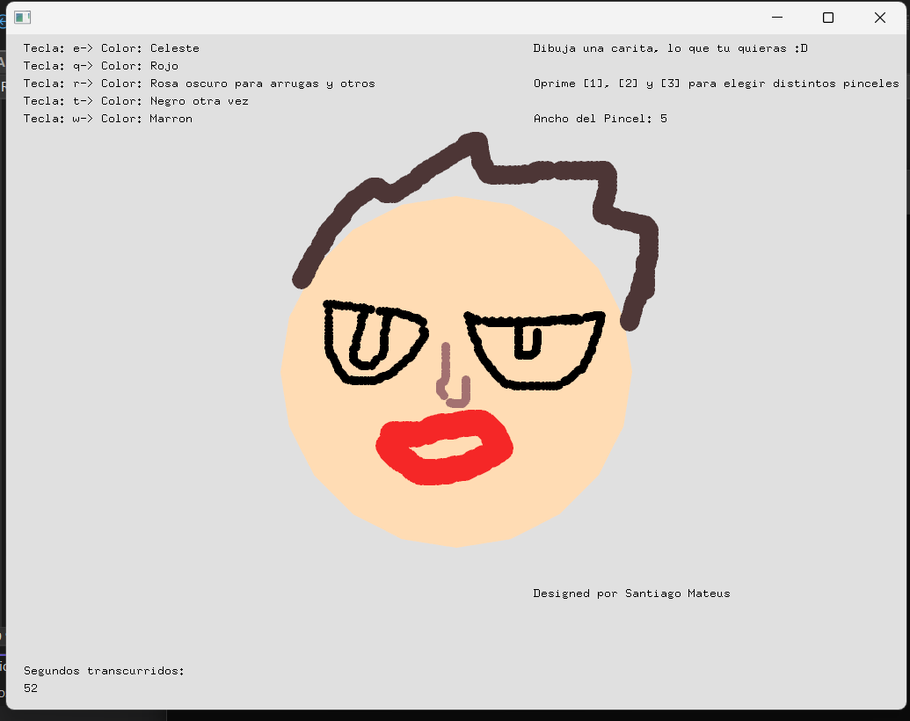

## Diseño y desarrollo del proyecto

### Pregunta 1: ¿Cuál fue la idea inicial de tu proyecto de arte generativo en openFrameworks?
Mi idea fue generar una aplicaicón de escritorio que simulara un "Paint" sencillo donde lo único que se pudiera editar son los componentes de un rostro. 

### Pregunta 2: ¿Qué tipo de pinceles, figuras o dinámicas decidiste implementar y por qué?
Decidí implementar 3 pinceles, con distinto grosor, forma y color para que el usuario tuviera elementos no tan limitados de edición.

### Pregunta 3: ¿Cómo aplicaste los conceptos de encapsulamiento, herencia y polimorfismo en el diseño de tus pinceles/clases?

Foto del programa mostrando la cara base dibujada.

Foto mostrando el uso de un pincel (círculo, cuadrado o dinámico).

Foto mostrando el cambio de color o grosor.

## Experimentación – Memoria, rendimiento y optimización

### Pregunta 4: ¿Qué impacto tuvieron tus decisiones de diseño (uso de objetos, clases, métodos virtuales, etc.) en el rendimiento del programa?
El uso de clases y métodos virtuales permitió flexibilidad y polimorfismo, pero añadió una ligera sobrecarga en el rendimiento, aunque casi imperceptible en este proyecto.

### Pregunta 5: ¿Qué mediciones hiciste en Visual Studio para comprobar memoria y rendimiento?
El uso de clases y métodos virtuales permitió flexibilidad y polimorfismo, pero añadió una ligera sobrecarga en el rendimiento, aunque casi imperceptible en este proyecto.

### Pregunta 6: ¿Intentaste optimizar alguna parte del código? ¿Cómo?
Ooptimicé evitando cálculos innecesarios en draw() y usando estructuras simples como vectores en lugar de contenedores más pesados.

Foto de una prueba de rendimiento en Visual Studio (por ejemplo, FPS o profiler).

## PROMT PARA ChatGPT: "¿Cómo puedo optimizar mi proyecto de arte generativo en openFrameworks para mejorar el rendimiento? ¿Qué impacto tienen los métodos virtuales y cómo puedo minimizar su sobrecarga?" 

Usa ofMesh / VBOs / instancing para reducir draw calls.
Mueve cálculos a shaders en GPU.
Evita recalcular datos que no cambian cada frame.
Métodos virtuales añaden una ligera sobrecarga por la vtable.
Minimízala usando final, plantillas (CRTP) o composición en lugar de herencia profunda.

## Reflexión y Ajuste Final

### Pregunta 7: ¿Qué ajustes finales realizaste para mejorar el código o la experiencia de usuario?
Implementé cambios en la organización para unir distintos tipos de datos y que la memoria se usara de forma más ahorrativa o asertiva. Además, diseñé funciones para que fuera más intuitivo, fácil de usar y personalizable. Una funcion final importante fue el uso de una memoria que guarda los tamaños y colores de los puntos, para que cuando el usuario al cambiar sus atributos, como color y tamaño, no cambie  los puntos ya dibujados anteriormente.

### Pregunta 8: ¿Cómo influyó el entendimiento de los mecanismos internos de OOP en tu forma de programar el proyecto?
Por medio de los conocimientos adquiridos en clase pude determinar maneras sencillas pero funcionales para generar encapsulamiento de clases y que tengan atributos no editables o alterables. El polimorfismo y la herencia se ve en como implementé el cambio de tamaños y 'Brushes' en el código. 

## Pregunta 9: ¿Qué desafíos enfrentaste y cómo los resolviste?
En general lo más difícil fue implementar cada cosa que se me ocurría, ya fuera algo estético o funcional para implementar herencia y polimorfismo.

## Pregunta 10: ¿Qué aprendiste sobre el equilibrio entre diseño (código limpio, OOP) y eficiencia (rendimiento, optimización)?
Aprendí que un buen diseño con OOP hace el código más claro y mantenible, pero a veces hay que sacrificar complejidad para no perder eficiencia en el rendimiento.

Foto de la versión final del proyecto funcionando.

 
## Evidencias de Resultados de Aprendizaje (RAE)

### RAE1: Construcción de la aplicación interactiva.
#### Pregunta 11: ¿Cómo demuestras que tu aplicación cumple con los requisitos funcionales y no funcionales establecidos?
El código deja en claro el uso de polimorfismos y herencia entre clases. Y los requisitos no funcionales como el ajuste de memoria también por medio de la gestión de la misma, eliminando lo que no y utilizando variables con métodos ya creados por OF, junto con atributos "unidos".

### RAE2: Pruebas de las partes y del todo de la aplicación.
#### Pregunta 12: ¿Qué pruebas hiciste a cada parte del proyecto (pinceles, cambio de color, tamaño, temporizador)?
Probé cada método mientras diseñaba la interfaz con tal de ver si funcionaba en ese momento. Cada cambio que le hice era probado inmediatamente. Finalmente después de tener el Reto que entregué en Unidad4, proseguí a probarlo entero cada parte que poseía. 

### Pregunta 13: ¿Qué pruebas hiciste al proyecto completo y cómo comprobaste que funciona de manera correcta?
Realicé diversos dibujos, probé que el grosor de los puntos cambiara, intercambié el pincel por los 3 que hay. Probé todos los colores y la interfaz visual funciona a la perfección pues todos los textos se encuentran visibles.

## Prueba de funcionamiento total: 
