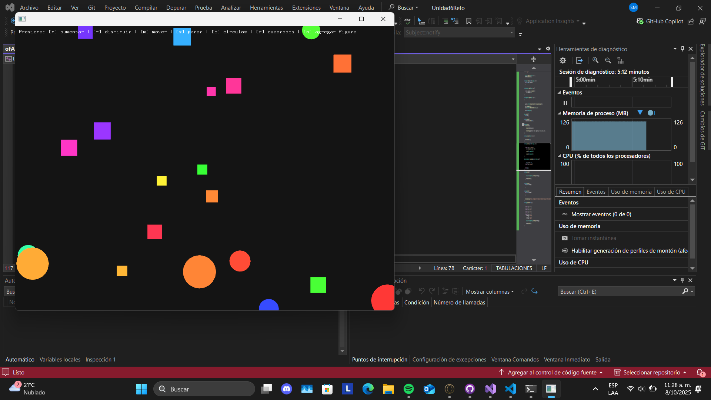
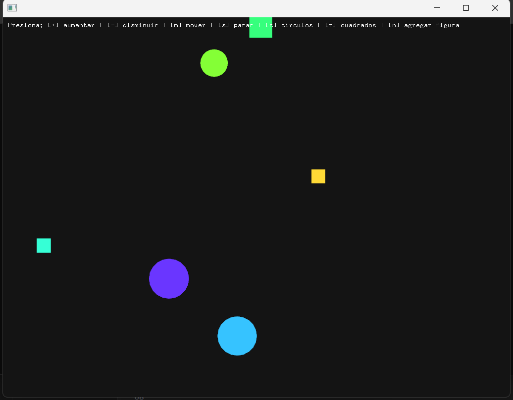
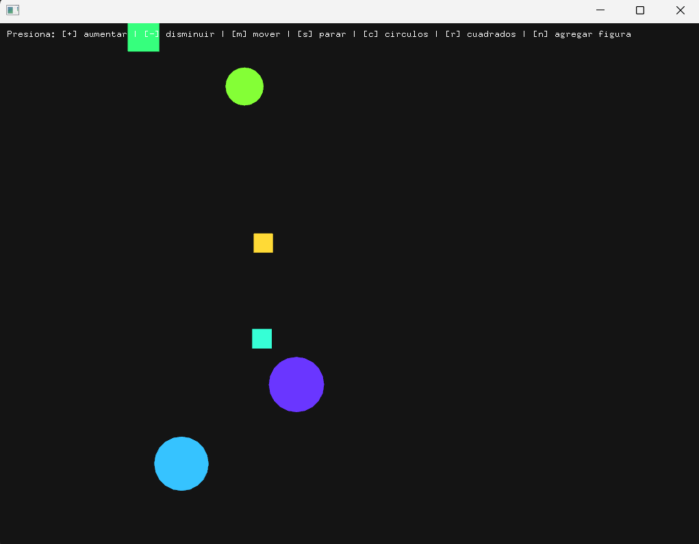
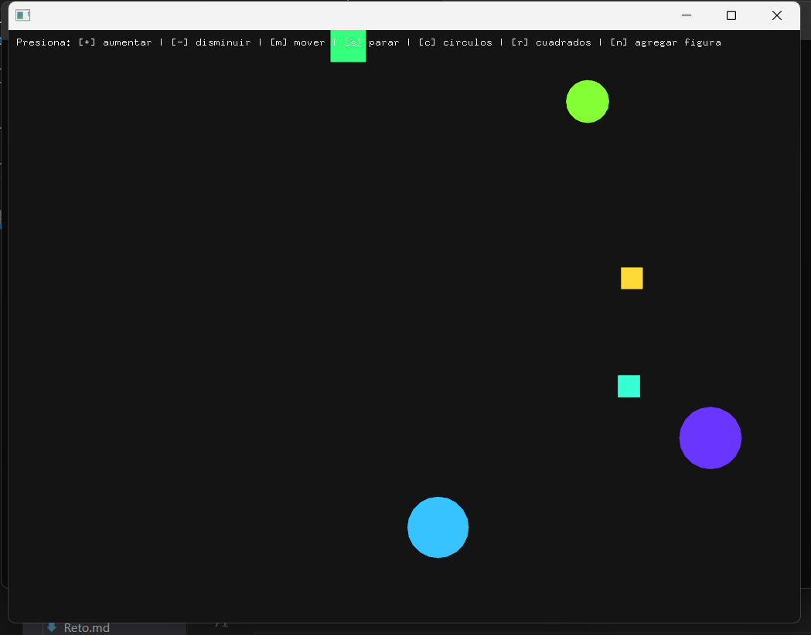

## RAE 1: 

### Construcción de la APP:
La aplicación consiste en un entorno gráfico donde se generan figuras (círculos y cuadrados) que se mueven en línea recta dentro de la ventana.
El usuario puede:

1. Aumentar o disminuir el tamaño de las figuras.
2. Pausar y reanudar su movimiento.
3. Cambiar el tipo de figura (círculo o cuadrado).
4. Añadir nuevas figuras dinámicamente.

Cada figura responde a eventos globales enviados por la aplicación principal mediante el patrón Observer, y su comportamiento cambia según el patrón State. Las figuras se crean con el patrón Factory para mantener independencia del tipo de objeto generado.



### Patrones de diseño:

#### Factory: 
Se utilizó para crear objetos del tipo Shape (ya sea círculo o cuadrado) de forma controlada y extensible.
Esto permite añadir nuevos tipos de figuras sin modificar el código principal de la aplicación.

```cpp:
Class ShapeFactory
Método principal: createShape(const std::string & type)
Ejemplo: cuando el usuario presiona la tecla n, la aplicación usa el factory para crear una nueva figura del tipo seleccionado.
``` 

#### Observer: 
Se implementó para comunicar los eventos globales (como aumentar tamaño, detener movimiento, etc.) desde ofApp hacia todos los objetos Shape.

```cpp:
Clase: Subject (superclase de ofApp) mantiene la lista de observadores.
Cada Shape hereda de Observer y sobrescribe onNotify(const std::string & event).
Así, al presionar una tecla, ofApp llama a notify(event) y todas las figuras reaccionan al mismo tiempo.
``` 
#### State: 
Define el comportamiento dinámico de las figuras.
Cada figura tiene un estado (MovingState o StoppedState) que determina si se mueve o no en cada actualización.

```cpp:
Cuando el usuario presiona m, cambia al estado MovingState.
Cuando presiona s, cambia al estado StoppedState.
Esto permite modificar el comportamiento sin condicionales extensos, favoreciendo la mantenibilidad.
``` 
### Código fuente: 
El código completo está dividido en dos archivos:

ofApp.h (definición de clases y patrones)
ofApp.cpp (implementación funcional de los patrones)

El código fue desarrollado en C++ con openFrameworks, siguiendo la arquitectura modular y respetando los principios de encapsulamiento y polimorfismo.

### Videos:
[Vídeo😝](https://youtu.be/jRakT6VD5Qk)
[Vídeo del resto del funcionamiento😝](https://youtu.be/RDDraVZvpjI)

## RAE 2:

### Pruebas de cada patrón:

#### Factory: 
Se probó cambiando entre tipos "circle" y "square" antes de crear nuevas figuras.
Se comprobó que las figuras creadas correspondieran al tipo seleccionado sin errores visuales.



#### Observer: 
Se verificó que al presionar las teclas + o -, todas las figuras cambiaran de tamaño simultáneamente.
También que los eventos s (stop) y m (move) afectaran a todas las figuras a la vez.





#### State: 
Se comprobó que, al cambiar entre los estados, las figuras efectivamente detuvieran o reanudaran su movimiento sin reiniciar su posición.

### Prueba de toda la app:
Se ejecutó la aplicación completa verificando que todos los eventos funcionaran en conjunto.
No se encontraron errores de ejecución ni conflictos entre patrones.
Se validó que el rendimiento fuera estable con múltiples figuras (hasta 50 en pantalla sin caída de frames).

(Ver video para comprobar)

### Conclusión: 
La aplicación cumple los requisitos funcionales del reto al aplicar correctamente los tres patrones de diseño, y los requisitos no funcionales al mantener un código modular, claro y extensible.
Se evidencia un dominio práctico del uso de patrones de comportamiento y creación dentro de un contexto gráfico interactivo.

## Códigos: 

### ofApp.h 

```cpp
#pragma once
#include "ofMain.h"
#include <string>
#include <vector>

class Observer {
public:
	virtual void onNotify(const std::string & event) = 0;
};

class Subject {
public:
	void addObserver(Observer * obs);

protected:
	void notify(const std::string & event);

private:
	std::vector<Observer *> observers;
};

class Shape;

class State {
public:
	virtual void update(Shape * shape) = 0;
	virtual void onEnter(Shape * shape) { }
	virtual ~State() = default;
};

class MovingState : public State {
public:
	void update(Shape * shape) override;
};

class StoppedState : public State {
public:
	void update(Shape * shape) override;
};

class Shape : public Observer {
public:
	Shape();
	~Shape();

	void update();
	void draw();
	void setState(State * newState);
	void onNotify(const std::string & event) override;

	ofVec2f position;
	float speed;
	float size;
	ofColor color;
	bool isCircle;

private:
	State * state;
};

class ShapeFactory {
public:
	static Shape * createShape(const std::string & type);
};

class ofApp : public ofBaseApp, public Subject {
public:
	void setup();
	void update();
	void draw();
	void keyPressed(int key);

private:
	std::vector<Shape *> shapes;
	int shapeCount = 1;
	std::string currentType = "circle";
};
```
### ofApp.cpp

```cpp
#include "ofApp.h"

	void
	Subject::addObserver(Observer * obs) {
	observers.push_back(obs);
}

void Subject::notify(const std::string & event) {
	for (auto * obs : observers) {
		obs->onNotify(event);
	}
}

void MovingState::update(Shape * shape) {
	shape->position.x += shape->speed;
	if (shape->position.x > ofGetWidth()) {
		shape->position.x = 0;
	}
}

void StoppedState::update(Shape * shape) {
	// No movement
}

Shape::Shape() {
	position = ofVec2f(ofRandom(ofGetWidth()), ofRandom(ofGetHeight()));
	speed = ofRandom(2, 5);
	size = ofRandom(20, 50);
	color = ofColor::fromHsb(ofRandom(255), 200, 255);
	isCircle = true;
	state = new MovingState();
}

Shape::~Shape() {
	delete state;
}

void Shape::update() {
	if (state) state->update(this);
}

void Shape::draw() {
	ofSetColor(color);
	if (isCircle) {
		ofDrawCircle(position, size);
	} else {
		ofDrawRectangle(position.x - size / 2, position.y - size / 2, size, size);
	}
}

void Shape::setState(State * newState) {
	if (state) delete state;
	state = newState;
	state->onEnter(this);
}

void Shape::onNotify(const std::string & event) {
	if (event == "increase") {
		size += 5;
	} else if (event == "decrease") {
		size = std::max(5.0f, size - 5.0f);
	} else if (event == "stop") {
		setState(new StoppedState());
	} else if (event == "move") {
		setState(new MovingState());
	}
}

Shape * ShapeFactory::createShape(const std::string & type) {
	Shape * shape = new Shape();
	if (type == "circle") {
		shape->isCircle = true;
	} else if (type == "square") {
		shape->isCircle = false;
	}
	return shape;
}

void ofApp::setup() {
	ofBackground(20);
	for (int i = 0; i < shapeCount; ++i) {
		Shape * s = ShapeFactory::createShape(currentType);
		addObserver(s);
		shapes.push_back(s);
	}
}

void ofApp::update() {
	for (auto * s : shapes) {
		s->update();
	}
}

void ofApp::draw() {
	for (auto * s : shapes) {
		s->draw();
	}

	ofSetColor(255);
	ofDrawBitmapString("Presiona: [+] aumentar | [-] disminuir | [m] mover | [s] parar | [c] circulos | [r] cuadrados | [n] agregar figura", 10, 20);
}

void ofApp::keyPressed(int key) {
	if (key == '+') {
		notify("increase");
	} else if (key == '-') {
		notify("decrease");
	} else if (key == 'm') {
		notify("move");
	} else if (key == 's') {
		notify("stop");
	} else if (key == 'c') {
		currentType = "circle";
	} else if (key == 'r') {
		currentType = "square";
	} else if (key == 'n') {
		Shape * s = ShapeFactory::createShape(currentType);
		addObserver(s);
		shapes.push_back(s);
	}
}
```