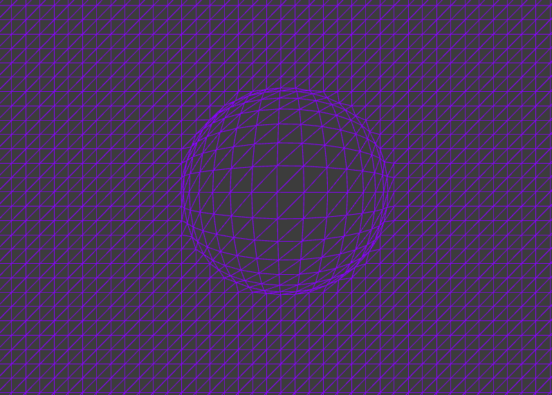

## Actividad 1: 

### ¿Qué son los vértices? 
En un modelo 3D, los vértices actúan como los pilares estructurales. Son los puntos de coordenadas que determinan con precisión las ubicaciones de las aristas y caras de la figura.
### ¿Con qué figura geométrica se dibuja en 3D? 
Los entornos 3D son predominantemente construidos a partir de triángulos. Esta elección se debe a que su simplicidad inherente los convierte en la figura geométrica más básica que existe, permitiendo que los cálculos sean rápidos y estables al garantizar que cada cara se mantenga en un mismo plano.
### ¿Qué es un shader?
Un shader es un programa ligero que se ejecuta directamente en la GPU (Unidad de Procesamiento Gráfico). Su función es instruir a la tarjeta gráfica sobre cómo calcular y determinar los atributos finales de cada píxel en la pantalla, manejando aspectos cruciales como el color, la interacción con la luz y los efectos visuales.
### ¿Cómo se le llaman a los grupos de pixeles de un mismo triángulo?
Se les llama fragmentos
### ¿Qué es un fragment shader?
Es el shader que trabaja en cada fragmento del dibujo.
### ¿Qué es un vertex shader?
Es un programa ligero ejecutado en la GPU que procesa individualmente los vértices de la malla. Su función principal es transformar las coordenadas de posición de los vértices (desde el espacio del modelo al espacio de la pantalla) para su correcta proyección.
### ¿Al proceso de determinar qué pixels del display va a cubrir cada triángulo de una mesh se le llama?
Ese proceso se denomina rasterización.
### ¿Qué es el render pipeline?
Es la secuencia ordenada de pasos computacionales ejecutados por la GPU para convertir la descripción geométrica 3D (vértices, shaders) en una imagen 2D proyectada en la pantalla. Funciona como una cadena de producción de imágenes.
### ¿Hay alguna diferencia entre aplicar un color a una superficie de una mesh o aplicar una textura?
Sí. La aplicación de un color asigna un único valor tonal a toda la superficie poligonal. Una textura, en cambio, es una imagen bidimensional (mapa de píxeles) que se mapea sobre el objeto para añadir complejidad visual, como detalles de metal o madera.
### ¿Cuál es la diferencia entre una textura y un material?
Una textura es un mapa de datos visuales (pattern o imagen). Un material es un conjunto de propiedades que definen la interacción del objeto con la luz (incluyendo su brillo, reflexión y transparencia), y que puede utilizar múltiples texturas para lograr su apariencia final.
### ¿Qué transformaciones se requieren para mover un vértice del 3D world al View Screen?
Se requiere una secuencia de tres transformaciones matriciales: primero la transformación del modelo (Model), luego la transformación de vista (View), y finalmente la proyección (Projection).
### ¿Al proceso de convertir los triángulos en fragmentos se le llama?
Este proceso es conocido como rasterización.
### ¿Qué es el framebuffer?
Es un área de memoria de vídeo temporal utilizada para almacenar todos los datos de los píxeles (incluyendo color y profundidad) antes de que la imagen completa sea enviada y visualizada en el monitor.
### ¿Para qué se usa el Z-buffer o depth buffer en el render pipeline?
Se utiliza para el manejo de la profundidad. Almacena el valor de distancia (Z) de cada píxel renderizado con respecto a la cámara, permitiendo a la GPU determinar qué objeto está delante de otro y resolver correctamente la oclusión.
### Luego de ver el segundo video entiendes por qué la GPU tiene que funcionar tan rápido y de manera paralela. ¿Por qué?
La GPU opera mediante un sistema de procesamiento masivamente paralelo. Esto es necesario porque debe realizar millones de cálculos simultáneos sobre un inmenso volumen de datos (miles de vértices y millones de píxeles) en tiempo real para garantizar una experiencia visual fluida en aplicaciones dinámicas como los videojuegos.

## Actividad 2

### Primer Ejemplo: 

#### ¿Cómo funciona?
La ejecución inicializa el programa shader y lo aplica a una primitiva geométrica (quad o rectángulo) que cubre la pantalla. Dentro del ciclo de renderizado (draw()), la activación del shader (shader.begin()) delimita el área de influencia. Todas las operaciones de dibujo entre el inicio y el final de la llamada al shader son procesadas por la GPU y afectadas por el código shader cargado

#### ¿Qué resultados obtuviste?
 

#### ¿Estás usando un vertex shader?
Sí

### ¿Estás usando un fragment shader?
Sí

#### Analiza el código de los shaders. ¿Qué hace cada uno?
El vertex shader funciona como un paso de transformación posicional mínima (passthrough). Simplemente procesa las coordenadas de los vértices del rectángulo y las reenvía al render pipeline para la correcta ubicación geométrica. El fragment shader tiene la responsabilidad de determinar y asignar el color final a cada píxel o fragmento generado.

### Segundo Ejemplo: 

#### ¿Cómo funciona?
El sistema renderiza un plano geométrico 3D en el centro de la pantalla, cuya malla es manipulada por el vertex shader. La apariencia y transformación del plano están controladas por uniforms externos: el color se interpola a lo largo del eje X del mouse (variando de magenta a cian) y la rotación tridimensional se aplica en función de la posición Y del mouse.

#### ¿Qué resultados obtuviste?


#### ¿Estás usando un vertex shader?
Sí. El vertex shader es esencialmente un programa de deformación geométrica, ya que es responsable de alterar las coordenadas espaciales de cada vértice del plano.

### ¿Estás usando un fragment shader?
Sí. El fragment shader determina el color final de los fragmentos, utilizando la información del color global provista por la aplicación host (a través de ofSetColor() o equivalente).

#### Analiza el código de los shaders. ¿Qué hace cada uno?
El Vertex Shader utiliza la variable de tiempo (time) como input para introducir un factor de animación temporal que modifica dinámicamente la posición de los vértices, causando la deformación continua del plano. El Fragment Shader aplica la variable de color (globalColor) que se inyecta desde el código de la CPU (la función ofSetColor()), lo que permite que el color de la superficie se ajuste según la lógica externa (posición X del mouse).

### Tercer Ejemplo: 

#### ¿Cómo funciona?
El programa establece un plano bidimensional que cubre la totalidad del área de dibujo (fullscreen quad) y le aplica un shader. La lógica externa calcula la posición del cursor y un valor de color interpolado (entre morado y azul), enviándolos al shader como variables uniformes. El shader utiliza esta información para aplicar una deformación visual focalizada (efecto de ojo de pez o distorsión localizada) en la posición del mouse, a la vez que calcula el cambio de color para toda la superficie.

#### ¿Qué resultados obtuviste?


#### ¿Estás usando un vertex shader?
Sí. El vertex shader es el responsable de la deformación de la geometría del plano, alterando las coordenadas de sus vértices en respuesta a la posición del cursor.

### ¿Estás usando un fragment shader?
Sí. El fragment shader es el encargado de la coloración final, utilizando la posición del mouse para calcular un gradiente que resulta en la transición del color (morado a azul) de los fragmentos.

#### Analiza el código de los shaders. ¿Qué hace cada uno?
El Vertex Shader procesa la posición del cursor (una variable uniform) para aplicar una transformación geométrica que produce el efecto de deformación del plano. El Fragment Shader utiliza la posición del cursor para realizar el cálculo del color de salida, generando la variación cromática observada en la pantalla.
```cpp
// color changes from magenta to blue when moving the mouse from left to right.
float percentX = mouseX / (float)ofGetWidth();
percentX = ofClamp(percentX, 0, 1);
ofFloatColor colorLeft = ofColor::magenta;
ofFloatColor colorRight = ofColor::blue;
ofFloatColor colorMix = colorLeft.getLerped(colorRight, percentX);
```

### Cuarto Ejemplo: 

#### ¿Cómo funciona?
Una textura (imagen) es cargada y mapeada sobre una primitiva plana (el plano). El shader recibe la posición del cursor como una variable uniform y utiliza esta información para calcular un desplazamiento de las coordenadas del plano o de la textura, creando el efecto de que la imagen se mueve al seguir el mouse.

#### ¿Qué resultados obtuviste?


#### ¿Estás usando un vertex shader?
Sí. El vertex shader se encarga de procesar y transformar las coordenadas que definen la posición geométrica de los vértices del plano.

### ¿Estás usando un fragment shader?
Sí. El fragment shader es el responsable de realizar la toma de muestras (sampling) de la textura de la imagen para cada fragmento, determinando el color final en función de las coordenadas de textura recibidas.

#### Analiza el código de los shaders. ¿Qué hace cada uno?
El Vertex Shader utiliza la posición del cursor para calcular y aplicar un desplazamiento a los vértices del plano. Este movimiento se transfiere al pipeline para la rasterización. El Fragment Shader utiliza las coordenadas de textura (que pueden estar siendo afectadas por el vertex shader) para realizar el muestreo de la imagen, asignando el color final del píxel en la pantalla.

### Quinto Ejemplo: 

#### ¿Cómo funciona?
El programa carga dos texturas simultáneamente: una imagen base y una segunda imagen destinada a operar como máscara. Un shader especializado es el encargado de la combinación de estas dos texturas a nivel de píxel, aplicando un efecto de masking donde los valores de la máscara definen la opacidad o la mezcla de la imagen base.

#### ¿Qué resultados obtuviste?


#### ¿Estás usando un vertex shader?
Sí. El vertex shader se utiliza para el procesamiento posicional de los vértices y las coordenadas de textura (UVs). Esta preparación es necesaria para que el fragment shader pueda recibir la información geométrica y las coordenadas correctas para aplicar los efectos visuales.

### ¿Estás usando un fragment shader?
Sí. Este shader realiza la operación visual principal. Lee los valores de color de la imagen base y de la máscara, y combina los píxeles (o fragmentos) utilizando el valor de la máscara para controlar la transición o visibilidad de la imagen, logrando el efecto de enmascaramiento.

#### Analiza el código de los shaders. ¿Qué hace cada uno?
El Vertex Shader procesa la geometría del plano y sus correspondientes coordenadas de textura, asegurando que la imagen se posicione correctamente en la pantalla. El Fragment Shader ejecuta la lógica de masking. Accede a ambas texturas y aplica una función de mezcla (blend) basada en los valores de la máscara (generalmente la luminancia o un canal específico), determinando el color final visible en cada píxel.

### Sexto Ejemplo: 

#### ¿Cómo funciona?
El sistema realiza una fusión visual de tres fuentes de textura distintas (cámara en vivo, imagen fija y video), controlada por una cuarta textura que actúa como máscara multicanal. El shader recibe la posición del mouse como uniform para desplazar la máscara. Luego, el shader utiliza los canales de color Rojo (R), Verde (G) y Azul (B) de la máscara para determinar la proporción de mezcla de cada una de las tres texturas de entrada a nivel de píxel.

#### ¿Qué resultados obtuviste?


#### ¿Estás usando un vertex shader?
Sí. El vertex shader se emplea principalmente para la transferencia de coordenadas de posición y UVs hacia la siguiente etapa del pipeline (el fragment shader), actuando como un puente de datos.

### ¿Estás usando un fragment shader?
Sí. El fragment shader ejecuta la lógica de mezcla (blending). Es el encargado de calcular el color de salida de cada píxel basándose en una interpolación trilineal controlada por los valores cromáticos de la máscara y las tres texturas de entrada.

#### Analiza el código de los shaders. ¿Qué hace cada uno?
El Vertex Shader funciona como un paso passthrough, procesando las coordenadas de los vértices sin aplicar transformaciones complejas, y asegurando que las UVs estén disponibles para el fragment shader. El Fragment Shader implementa la lógica de mezcla basada en canales. Recibe las tres texturas de contenido (tex0, tex1, tex2) y la máscara, y utiliza los componentes R, G y B de la máscara (imageMask) como factores de ponderación para mezclar las texturas correspondientes.

### Séptimo Ejemplo: 

#### ¿Cómo funciona?
El programa utiliza un Objeto Búfer de Frame (FBO) como canvas secundario para el dibujo en tiempo real. Los trazos de la "brocha" (normal o borrador) se graban continuamente en el FBO. La textura resultante del FBO actúa como una máscara dinámica dentro del shader, controlando la mezcla o visibilidad de otras texturas o imágenes en la escena principal.

#### ¿Qué resultados obtuviste?


#### ¿Estás usando un vertex shader?
Sí. El vertex shader es necesario para el procesamiento posicional del plano sobre el cual se aplica el shader y para transferir las coordenadas de textura (UVs) al fragment shader.

### ¿Estás usando un fragment shader?
Sí. El fragment shader realiza la operación visual principal. Lee el color de las texturas que se quieren mostrar y la textura de la máscara (generada por el FBO), utilizando esta última para modular la opacidad o la mezcla de las otras imágenes a nivel de píxel.

#### Analiza el código de los shaders. ¿Qué hace cada uno?
El Vertex Shader procesa las coordenadas de los vértices del plano y transfiere las coordenadas de textura (UVs) necesarias para el muestreo de texturas. El Fragment Shader ejecuta la lógica de masking. Realiza el muestreo de la textura de la brocha/máscara (proveniente del FBO) y la utiliza para interpolar o seleccionar el color final de las otras texturas de entrada, logrando el efecto de "pintura" o "borrado" interactivo.

### Octavo Ejemplo: 

#### ¿Cómo funciona?
El programa genera un plano poligonal cuya geometría es dinámicamente afectada por un shader. Utiliza la función de Ruido de Perlin para generar una textura de ruido que varía con el tiempo. Esta textura es usada para calcular un desplazamiento vertical en la malla, creando una animación de superficie similar a una tela arrugada que responde a la interacción del cursor.

#### ¿Qué resultados obtuviste?


#### ¿Estás usando un vertex shader?
Sí. El vertex shader es el responsable de la manipulación geométrica de la malla al alterar la posición de sus vértices, permitiendo el movimiento y la deformación de la superficie del plano.

### ¿Estás usando un fragment shader?
Sí. El fragment shader tiene como función principal el cálculo y la asignación del color definitivo a cada fragmento (píxel) generado.

#### Analiza el código de los shaders. ¿Qué hace cada uno?
El Vertex Shader implementa una técnica de desplazamiento de vértices. Utiliza los valores de la textura de Ruido de Perlin (noise texture) para modificar la coordenada Z (profundidad) de cada vértice, simulando un relieve tridimensional o un efecto de paño arrugado en la superficie. El Fragment Shader determina el color final, basándose en la información lumínica o de color que se le suministre.

### Noveno Ejemplo: 

#### ¿Cómo funciona?
El sistema aplica un efecto de desenfoque gaussiano (Blur) a una imagen mediante un proceso de dos pasos, utilizando dos shaders de fragmentos separados (conocido como two-pass blur). Un shader realiza el desenfoque horizontal (eje X) y el segundo, el desenfoque vertical (eje Y). Esta separación maximiza la eficiencia de cálculo y se logra generalmente renderizando la imagen primero a un Frame Buffer Object (FBO) después del paso X, y luego usando ese FBO como input para el paso Y.

#### ¿Qué resultados obtuviste?


#### ¿Estás usando un vertex shader?
Sí. El vertex shader se utiliza para el manejo de las coordenadas de los vértices del plano y sus correspondientes coordenadas de textura (UVs), asegurando que la imagen se mapee correctamente y se pase la información de posición al fragment shader.

### ¿Estás usando un fragment shader?
Sí. El fragment shader es esencial para el efecto, ya que es el encargado de realizar el cálculo de blur. Esto se logra muestreando (sampling) múltiples píxeles vecinos alrededor del píxel actual y promediando sus valores de color para simular el desenfoque.

#### Analiza el código de los shaders. ¿Qué hace cada uno?
El Vertex Shader opera como un puente, transfiriendo las coordenadas de posición y textura de los vértices al fragment shader. La operación de desenfoque se divide entre los fragment shaders de la aplicación: el primero (shaderBlurX) aplica el desenfoque en la dirección horizontal (eje U de las coordenadas UV), y el segundo (shaderBlurY) toma el resultado del primero y aplica el desenfoque en la dirección vertical (eje V de las coordenadas UV).

## Actividad 3

### ¿Qué es un uniform?

### ¿Cómo funciona el código de aplicación, los shaders y cómo se comunican estos?

### SZxdxd